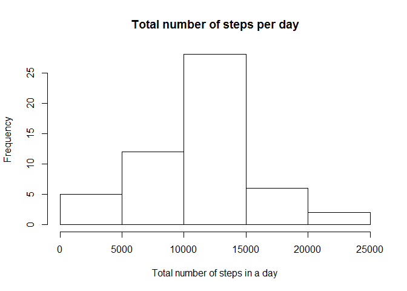
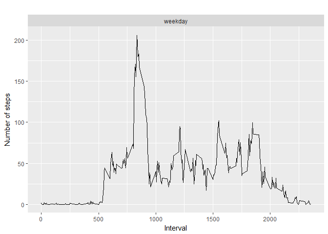

# Atividade1
Fernando  
15 de junho de 2017  
# 1ST Activity


```r
library(ggplot2)
library(scales)
library(Hmisc)
library(dplyr)
```

## Loading and preprocessing the data

```r
data_row <- read.csv('activity.csv')
data <- data_row[ with (data_row, { !(is.na(steps)) } ), ]
```
## What is mean total number of steps taken per day?

```r
by_day <- group_by(data, date)
steps_by_day <- summarise(by_day, total = sum(steps))
```

##### 1. Make a histogram of the total number of steps taken each day

```r
hist(steps_by_day$total, main="Total number of steps per day", 
     xlab="Total number of steps in a day")
```

<!-- -->

##### 2. Calculate and report the mean and median total number of steps taken per day

```r
stepsByDayMean <- mean(steps_by_day$total)
stepsByDayMedian <- median(steps_by_day$total)
```
* The Mean is: 1.0766189\times 10^{4}
* The Median is:  10765

-----

## What is the average daily activity pattern?

```r
steps_by_interval <- aggregate(steps ~ interval, data, mean)
```

##### 1. Make a time series plot

```r
plot(steps_by_interval$interval, steps_by_interval$steps, type='l', 
     main="Average number of steps over all days", xlab="Interval", 
     ylab="Average number of steps")
```

<!-- -->

##### 2. Which 5-minute interval, on average across all the days in the dataset, contains the maximum number of steps?

```r
max_steps_row <- which.max(steps_by_interval$steps)
max_steps<-steps_by_interval[max_steps_row, ]
```

* Max steps at: 835, 206.1698113

----

## Imputing missing values
##### 1. Calculate and report the total number of missing values in the dataset 

```r
numMissingValues <- sum(is.na(data_row))
```

* Number of missing values: 2304

##### 2. Devise a strategy for filling in all of the missing values in the dataset.
##### 3. Create a new dataset that is equal to the original dataset but with the missing data filled in.

```r
data_imputed <- data_row
for (i in 1:nrow(data_imputed)) {
  if (is.na(data_imputed$steps[i])) {
    interval_value <- data_imputed$interval[i]
    steps_value <- steps_by_interval[
      steps_by_interval$interval == interval_value,]
    data_imputed$steps[i] <- steps_value$steps
  }
}
df_imputed_steps_by_day <- aggregate(steps ~ date, data_imputed, sum)
```


##### 4. Make a histogram of the total number of steps taken each day 

```r
hist(df_imputed_steps_by_day$steps, main="Histogram of total number of steps per day (imputed)", 
     xlab="Total number of steps in a day")
```

<!-- -->

##### ... and Calculate and report the mean and median total number of steps taken per day. 

```r
stepsByDayMeanImputed <- mean(steps_by_day$total)
stepsByDayMedianImputed <- median(steps_by_day$total)
```
* Mean (Imputed): 1.0766189\times 10^{4}
* Median (Imputed):  10765
----
## Are there differences in activity patterns between weekdays and weekends?
##### 1. Create a new factor variable in the dataset with two levels - "weekday" and "weekend" indicating whether a given date is a weekday or weekend day.


```r
data_imputed['type_of_day'] <- weekdays(as.Date(data_imputed$date))
data_imputed$type_of_day[data_imputed$type_of_day  %in% c('Saturday','Sunday') ] <- "weekend"
data_imputed$type_of_day[data_imputed$type_of_day != "weekend"] <- "weekday"
data_imputed$type_of_day <- as.factor(data_imputed$type_of_day)
df_imputed_steps_by_interval <- aggregate(steps ~ interval + type_of_day, data_imputed, mean)
```

##### 2. Make a panel plot containing a time series plot


```r
# creat a plot
qplot(interval, 
      steps, 
      data = df_imputed_steps_by_interval, 
      type = 'l', 
      geom=c("line"),
      xlab = "Interval", 
      ylab = "Number of steps", 
      main = "") +
  facet_wrap(~ type_of_day, ncol = 1)
```

```
## Warning: Ignoring unknown parameters: type
```

<!-- -->
